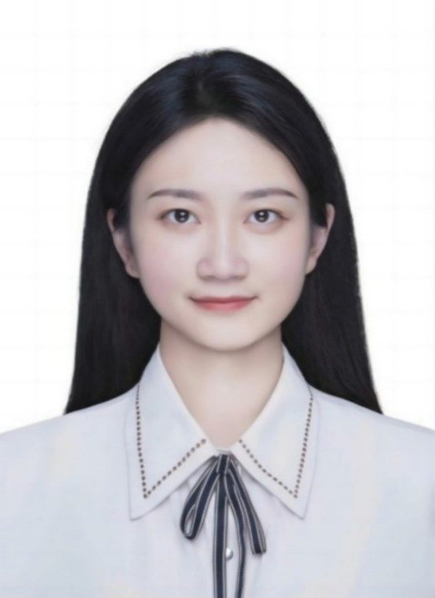
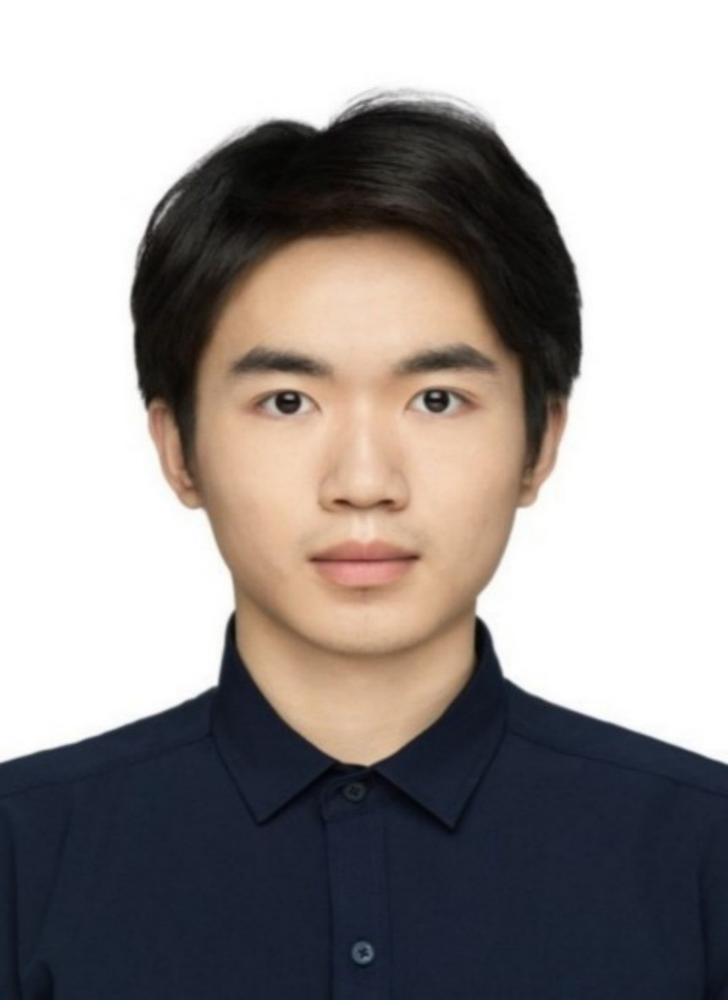
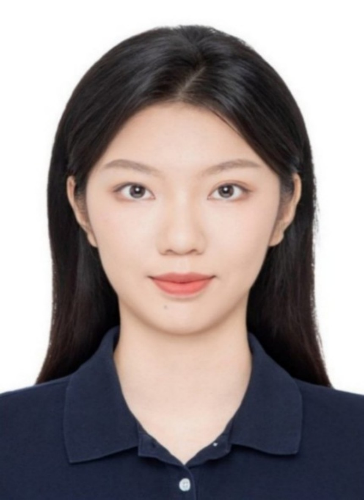

## PhD Students
<table  rules="none">
  <tr>
    <td  width="25%" align="center">
      

        
         
        Siyang Wu  
       Co-supervised 2023~ 
       AI security risk detection 　　　　
      

    </td>
    <td  width="25%" align="center">
      

        
         
        Jin Hu 
        Co-supervised 2023~ 
        Generative adversarial attack 　　　　
      

    </td>
    <td  width="25%" align="center">
      

        
         
        Zhengquan Sun 
        Co-supervised 2024~ 
        Adversarial attack  in Auto-driving
      

    </td>
    <td  width="25%" align="center">
      

        
         
        Yumeng Song 
        Co-supervised 2024~ 
        Physical attack  in lane detection
      

    </td>
  </tr>

  <tr>
    <td  width="25%" align="center">
      

        
         
        Zhanxu Tian  
        Co-supervised 2025~ 
        Explainable AI 　　　　
      

    </td>
  </tr>
</table>

## MSc Students
<table  rules="none">
  <tr>
    <td  width="25%" align="center">
      

        
         
        Yanni Xue 
        Co-supervised 2023~ 
        Adversarial attack and  jailbreak for LLM
      

    </td>
    <td  width="25%" align="center">
      

        
         
        Long Xu  
        Co-supervised 2023~ 
        Anti-customization 　　　　
      

    </td>
  </tr>

  <tr>
    <td  width="25%" align="center">
      

        
         
        Haojie Hao 
        Co-supervised 2024~ 
        Adversarial attack and  jailbreak for VLM 
      

    </td>
    <td  width="25%" align="center">
      

        
         
        Xiaoxi Yu  
        Co-supervised 2024~ 
        Backdoor detection 　　　　
      

    </td>
    <td  width="25%" align="center">
      

        
         
        Linna Jing 
        Co-supervised 2024~ 
        3D adversarial generation 　　　　
      

    </td>
  </tr>

  <tr>
    <td  width="25%" align="center">
      

        
         
        Jiachen Xu  
        Co-supervised 2025~ 
        Adversarial patch detection 　　　　
      

    </td>
  </tr>
</table>

## Undergranduate Students
<table  rules="none">
  <tr>
    <td  width="25%" align="center">
      

        
         
        Yujun Zhang  
        2024.01~2024.11 
        Beihang University 　　　　
      

    </td>
    <td  width="25%" align="center">
      

        
         
        Yanqu Chen 
        2024.01~2024.09 
        Nanyang Technological University
      

    </td>
    <td  width="25%" align="center">
      

        
         
        Yichi Zhang 
        2023~ 
        Nanyang Technological University
      

    </td>
    <td  width="25%" align="center">
      

        
         
        Chenhao Weng 
        2023~ 
        Nanyang Technological University
      

    </td>
  </tr>

  <tr>
    <td  width="25%" align="center">
      

        
         
        Haodong Liu  
        2024.4~2025.6 
        Academy of Military Science
      

    </td>
  </tr>

  <tr>
    <td  width="25%" align="center">
      

        
         
        Bowen Yang  
        2025~ 
        Nanyang Technological University
      

    </td>
  </tr>
  
</table>